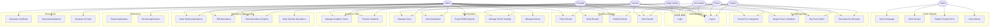

# Use Case Diagram

```mermaid
flowchart TD
    Visitor([Visitor])
    Student([Student])
    Parent([Parent])
    Teacher([Teacher])
    Accountant([Accountant])
    Admin([Admin])
    Principal([Principal])
    SuperAdmin([Super Admin])

    subgraph Public["Public Website"]
        UC1[View Homepage]
        UC2[Write Review]
        UC3[Submit Contact Form]
        UC4[View Notices]
    end

    subgraph Auth["Authentication"]
        UC5[Login]
        UC6[Logout]
    end

    subgraph Attendance["Attendance Management"]
        UC7[Mark Student Attendance]
        UC8[Edit Attendance]
        UC9[View Attendance Reports]
        UC10[Mark Teacher Attendance]
    end

    subgraph Results["Results & Grading"]
        UC11[Enter Results]
        UC12[Verify Results]
        UC13[Publish Results]
        UC14[View Results]
    end

    subgraph Fees["Fee Management"]
        UC15[Create Fee Categories]
        UC16[Assign Fees to Students]
        UC17[Pay Fees Online]
        UC18[Generate Fee Receipts]
    end

    subgraph Documents["Documents"]
        UC19[Generate Certificate]
        UC20[Generate Marksheet]
        UC21[Generate ID Card]
    end

    subgraph Academic["Academic Year"]
        UC22[Manage Academic Years]
        UC23[Promote Students]
    end

    subgraph Admissions["Admissions"]
        UC24[Submit Application]
        UC25[Review Applications]
    end

    subgraph AdminTasks["Administration"]
        UC26[Manage Users]
        UC27[View Dashboard]
        UC28[Export IEMIS Reports]
        UC29[Manage School Settings]
        UC30[Manage Notices]
    end

    Visitor --> UC1 & UC2 & UC3 & UC4
    Student --> UC5 & UC6 & UC14 & UC17
    Parent --> UC5 & UC6 & UC14 & UC17
    Teacher --> UC5 & UC6 & UC7 & UC8 & UC11 & UC14
    Accountant --> UC5 & UC6 & UC9 & UC15 & UC16 & UC18
    Admin --> UC5 & UC6 & UC7 & UC8 & UC9 & UC10 & UC11 & UC12 & UC13 & UC15 & UC16 & UC18 & UC19 & UC20 & UC21 & UC22 & UC23 & UC25 & UC26 & UC27 & UC28 & UC29 & UC30
    Principal --> UC5 & UC6 & UC9 & UC12 & UC13 & UC22 & UC23 & UC27
    SuperAdmin --> UC5 & UC6 & UC26 & UC29
```
